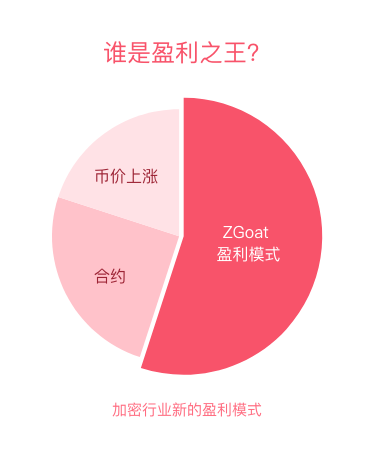

# 营销赛道的龙头ZGoat，超强的盈利模式有哪些？\(转发可获空投\)

[购买ZGoat请点击此处](https://exchange.pancakeswap.finance/#/swap)

## 一、营销赛道的完全空白

加密货币从诞生到现在，经历了四个阶段的发展：**2009-2013年 混沌时代、2013-2017年 炒作时代、2017-2021年 试金时代、2021-？ 赋能实体经济时代**。

混沌时代，人们通过小圈子人传人进行营销，效果甚微；2017年ICO大火，加密行业进入炒作时代，人们通过ICO疯狂的“万倍回报“进行营销，但缺乏应用落地而昙花一现；随着Defi应用的普及，加密行业进入试金时代，从借贷领域不断延伸到DEX、收益聚合、资产数据、跨链、预言机等领域，营销方式逐渐转型为社区模式。

加密行业的应用百花齐放，却均是基于产品赛道而设计，而基于市场营销赛道却完全空白。产品赛道琳琅满目，营销赛道却一片蓝海，ZGoat的出现，将填补这一空白，成为营销赛道的第一款产品。  

## 二、让DEFI营销娱乐化

加密货币作为共识经济的典型应用，共识越大，价值越大。Defi项目的火热，带动加密货币快速发展，然而仍然面临诸多问题：

* 普通用户参与门槛仍然较高
* 操作流程上也十分不便
* 参与频次较低

ZGoat通过将产品娱乐化，使用户群体更加广泛，使用频次更加高频，娱乐性更强，门槛更低。

以[WISH001](http://zgoat.org/#/Home)为例，小女孩通过平台发起的第一个心愿，热门事件为“扎克伯格的Bitcoin推特”。扎克伯格作为全球最大社交平台的创始人，自带巨大流量。而小女孩却是全球最普通的小人物，通过心愿把“扎克伯格”与“小女孩”联系起来，不仅话题自带巨大反差效应，还通过参与即奖励ZGoat，进一步激励用户参与。

1. _**\[娱乐化\]**_ ****帮助小女孩对话扎克伯格，形式娱乐化；
2. _**\[低门槛\]**_ 用户只需复制留言，即有机会获得奖励；
3. _**\[高频次\]**_ 人人均可发起心愿，心愿各不相同，产生高频应用；
4. _**\[二次营销\]**_ 高参与度能形成二次营销，逐步垄断加密行业的营销市场；

同样，任何热门话题均可嵌入心愿单，比如“吴亦凡事件“许愿——吴退出娱乐圈，“郑州洪水“许愿——郑州挺住，使ZGoat始终处于最新最热的话题中，用户参与度高，门槛低。不同于其他产品往往只有两三次热门话题，ZGoat能产生成千上万个热门话题，时时刻刻结合热门话题。

## 三、超强的盈利模式

与狗狗币、hib等基于社区纯共识驱动的项目不同，ZGoat是基于**营销--获利--再营销**的小闭环商业模型理念而推出的营销赛道创新型龙头产品，具有超强的盈利模式。根据市场经济学，对于共识经济产品，营销话题不足往往导致利润加速下滑，甚至入不敷出。

### 1.基础盈利能力是shib的315倍

ZGoat在设计之初，巧妙地将营销理念融入产品的小闭环设计，如上图所示，流程如下：

> * 根据当下社会的热门话题，生成心愿单，运营账户提供ZGoat奖励；
> * 用户参与方式简单化、娱乐化，保证行业外的普通用户也能参与；
> * 用户获得空投奖励，并通过购买ZGoat组成LP进行解锁，提升币价，产生手续费；
> * 手续费的部分收益打入运营账户，保证运营账户有足够的ZGoat进行不间断空投营销；
> * 选择新的热门话题，形成小闭环，使ZGoat时刻处于最热门的话题之中

以Shib为例，对比ZGoat的基础盈利能力。根据CoinMarketiCap的Shib交易数据，24h成交额为2.5亿美金，按近30天涨幅2.22%计算。对于ZGoat，**假设初期热度仅为Shib的1%。**

|  | Shib | ZGoat |
| :--- | :--- | :--- |
| 24h成交量 | 2.5亿 | 0.25亿 |
| 30天价格涨幅 | 2.22% | 150% |
| 投资成本 | 1000 | 0 |
| **收益** | **22.2** | **1750万** |


假设24h成交额平均每人贡献1000美金，则Shib参与人数为250000人，ZGoat参与人数为其1/100，约2500人。ZGoat运营账号在零成本情况下其利润计算为：（6% + 1%） \* 2.5亿 \* 1% \*（1+1/3）\* 30 \(1 + 150%\) = 1750万美金，其中 1%为运营账户分红预估占比，150%根据某同类产品模型，30天内币价预估上涨幅度。


从上述模型看，ZGoat的基础盈利能力是Shib的上万倍，即使通过空投将利润全部分给所有用户，同样假设每人投资1000美金，参与人数2500人，那么运营账户的利润平均每人为：1750万美金 / 2500人 = 7000美金。**即ZGoat项目的基础盈利能力是Shib项目的 7000 / 22.2 = 315倍。**

### 2.核心盈利场景多元化

ZGoat的设计初衷是帮助用户说出心愿。与抖音一样，每个人都有表达自我的需求，也有认同赞赏别人的需要。当ZGoat持有人数达到一定值时，平台将开放WISHLIST发布功能，包括文字、图文、视频形式。与抖音不同的是，心愿单具有一定目标性，摒弃了抖音纯消磨时间特性。

根据长尾理论，当某一产品能抓住长尾用户，将成为平台级产品。对于普通的DEFI项目，核心盈利场景往往只有1-2个，因此局限性很大。而ZGoat以营销娱乐化为切入点，帮助用户说出心愿，并通过其他用户的参与支持逐步实现心愿。每个用户的心愿不同，产生的应用场景也大不一样，同时也能个性化兼顾更多行业外的用户，降低DEFI项目的参与门槛。

发布心愿单的大致流程为：发布心愿 -&gt; 募集ZGoat -&gt; 用户参与 -&gt; 用户领取ZGoat奖励。在整个流程中，平台将产生诸多形式的收益，比如募集ZGoat期间的手续费收益、用户未领取奖励的50%打入运营账号、心愿单分佣、空投奖励解锁过程的币价拉高……

以某知名DEX的数据为例，对比ZGoat的核心盈利场景如下所示，假设ZGoat的有效场景率是该项目的20%。

|  | 某普通项目 | ZGoat |
| :--- | :--- | :--- |
| 场景数量 | 2 | 10000 |
| 每个场景成交额 | 1亿 | 1000 |
| 30天额度 | 60亿 | 0.6亿 |
| 手续费利润 | 3000万 | 420万 |
| LP解锁涨幅 | 0 | 630万 |
| 空投未领取 | 0 | 1200万 |
| 平台分佣 | 1/3 | 10% |
|  |  |  |
| **总利润** | **1000万** | **2850万** |


假设每个心愿单的募集ZGoat额度为价值1000美金的ZGoat，则30天的心愿单募集额为：10000 / 5 \* 30 \* 1000 = 6000万美金。收益为：（6% + 1%）\* 0.6亿  \* （1 + 150%）+ 0.6亿 \* 20% + 0.6亿 \* 10% = 4500万美金，其中1%为运营账户分红预估占比，150%根据某同类产品模型，30天内币价预估上涨幅度；未领取奖励比例假设为20%，分佣比例10%。


由于该部分收益的成本为零，因此为净收益，从而该部分利润可以用于拉伸币价或者其他营销活动，形成良性循环。另一方面，随着持币用户的增加，应用场景也将随之增加，该部分利润也将水涨船高，想象空间极大。

### 3.推荐者盈利模式：ROI = 12万倍

在以往的DEFI项目中，早期参与者将获得足够强的价格优势，这似乎不是很公平，谁带来的真实交易，就应该谁享受最高的手续费分红比例。ZGoat的邀请返佣机制，很好地满足了这个需求：

> 1. 邀请机制写入去中心化合约，不再人为干预，公平公正；
> 2. 不管是早期参与者，还是后期参与者，返佣机制都处于同一标准，并无先发优势。
> 3. 以前加密货币业往往只能靠代币价格上涨，或者合约做空做多赚钱，ZGoat的邀请返佣机制可能开创了一种全新的盈利模式。

以地址A是地址B的推荐者为例。地址A是第一个向地址B捐赠大于等于1000w个ZGoat，永久成为地址B的推荐者。以后地址B的每一笔交易，都将有1.2%或者0.6%返佣给地址A。以当前的币价，1000w个ZGoat的大约成本为1美金。

|  | 地址A |
| :--- | :--- |
| 投入成本 | 1000w ZGoat |
| 返佣比例 | 60% |
| 地址B月交易量=0 | -1美金 |
| 地址B月交易量=1000美金 | 12美金 |
| 地址B月交易量=10w美金 | 1200美金 |
| 地址B月交易量=1000w美金 | 12w美金 |
|  |  |
| **投资回报率** | **高达12万倍** |


根据邀请返佣规则，若地址B是一个大户，30天的交易额为1000w美金，则地址A可获得的手续费返佣为12w美金或者6w美金，**相当于月投资回报可达到12万倍**。

同时，地址A可以向多个用户进行邀请捐赠，若邀请的大部分用户均产生交易，则地址A的投资回报将会是一笔很大的数字收入。当然，若地址A邀请的用户不产生交易，地址A将亏损1美金。


谁将是付费邀请、去中心化合约的返佣机制的最强者，我们拭目以待。用户可以通过官网的[Check Referrer](http://zgoat.org/#/Reward)按钮查询某地址是否已有推荐者及返佣总奖励。



####  

### 4.未来盈利模式：赋能更多实体经济

加密货币从混沌时代发展至金融产品时代，长时间受制于营销赛道的发展瓶颈，在拓展加密货币的应用层面，难有突破。ZGoat的出现，或许能解决目前加密货币的窘境。

ZGoat在产品设计之初就围绕“营销娱乐化+零手续费交易所+娱乐消费+电子商务平台”进行，以长期共赢作为目标，致力于赋能实体经济。ZGoat发行总量为210000亿，初始烧毁110000亿，首次采用去中心化邀请返佣制度，并写入智能合约，返佣比例为持币人分红部分的60%。当燃烧到剩余数量为21000亿时，停止烧毁，并更新交易手续费比例。

随着未来赋能更多实体经济，盈利模式将更为可观。

**\[图片\]**

\*\*\*\*

**ZGoat，起源于一个小女孩的心愿，立足于让DEFI营销娱乐化，为开创加密货币的新时代而努力着…**

\*\*\*\*

\*\*\*\*

**🔥**  **空投环节：**



[点击此按钮](https://twitter.com/Goat22412341/status/1420290621319761920)，关注并转发推特，获赞超过10个可获得100w个ZGoat奖励，限前500名；获赞超过100个奖励翻十倍，限前100名。先到先得



[点击此链接](http://zgoat.org/sharelink)，加入电报群可获得奖励，或者邀请朋友加入电报群也可获得奖励，每成功邀请一个用户，可获得1w个ZGoat额外奖励，最多不超过100w个ZGoat额外奖励。



[点击此链接](http://zgoat.org/sharelinktest)，获得专属分享链接及文案，转发至微信朋友圈，获赞超过30个可获得100w个ZGoat奖励，限前1000名；获赞超过300个奖励数量翻十倍，限前500名。先到先得



Tips:

* 同一地址以上三个活动最多只能参加一个，同时参与多个按最高奖励算；
* 所有空投奖励均属于锁定状态，需质押LP进行解锁；

