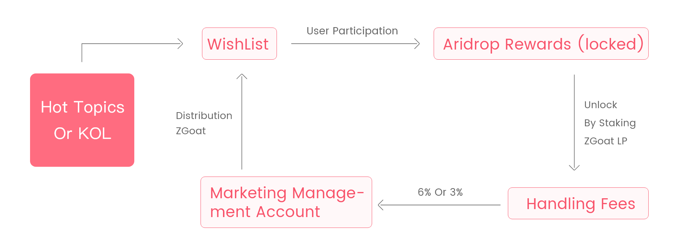
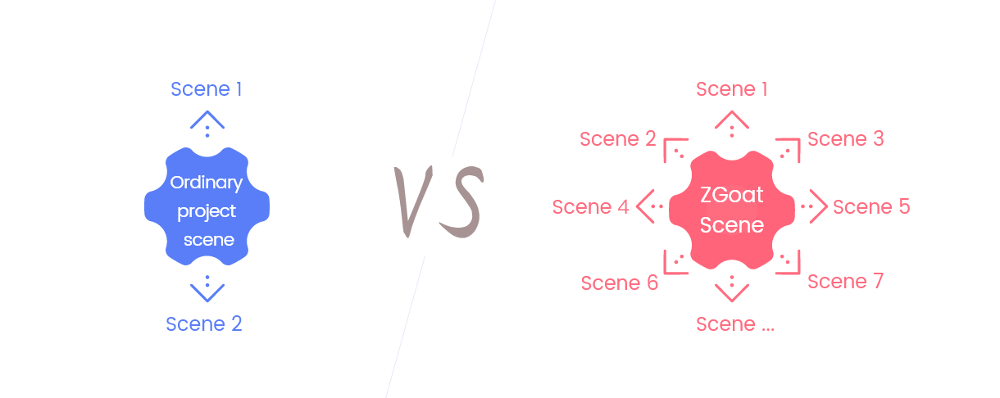

# ZGoat, The First Defi-Marketing Application With Big Business \(Airdrop At The End\)

[Click Buy ZGoat](https://exchange.pancakeswap.finance/#/swap)

## 一、Defi-Marketing Is Blank

Up to now, all current Defi application designs are based on the idea of basic product, the method of defi-marketing is just community with low efficiency. What's more, the Defi application design based on the idea of marketing is completely blank. The more product application, the stronger defi-marketing need. ZGoat will solve this problem and is the first Defi-marketing application with big business.

## 二、Make Defi-Marketing Easier

For any application of consensus economy, the stronger the consensus, the greater the value. The popularity of Defi has made the rapid development of cryptocurrency. However, it still faces many problems:

* The participation threshold for ordinary users is still high.
* The user experience is so bad.
* Low frequency

By entertaining, ZGoat makes the defi application more widely, frequency higher, entertaining more, and participation threshold lower.

Taking [WISH001](http://zgoat.org/#/Home) as example, the first wish launched by a little girl on ZGoat platform was related with Zuckerberg's Twitter about Bitcoin. As the founder of the world's largest social platform, Zuckerberg has huge followings. However the little girl is a common person in the world. the wish to combine "Zuckerberg" with "little girl", has its own huge topic effect. On the other hand, users will be rewarded with ZGoat Token by supporting the wish, which is a further encourage for users to participate.

1. _**\[Entertainment\]**_ Help the little girl meet Zuckerberg;
2. _**\[Low threshold\]**_ Users only need copy to comment, and they will get ZGoat reward;
3. _**\[High frequency\]**_ Everyone can make a wish with different ideas, generating high-frequency applications;
4. _**\[Second marketing\]**_ Huge participation can form new topic for marketing and ZGoat will gradually become the high efficient brand of defi-marketing;

As a result, any hot topic can be embedded in the wish list, such as "Wu Yifan event", that can be made a wish by someone, the theme such as "Kris Wu, ZhaNan". Another example, Zhengzhou Flood also can be made a wish, the theme such as "Zhengzhou Power".

ZGoat wishlist can combine the newest and hottest topic at any time, with high user participation and low threshold. Different from other products, which usually only have two or three Marketing Event. ZGoat can combine hot topics all the time, with various Marketing Event.

## 三、Big Business

Different from other product design based on the idea of product application , ZGoat is an innovative leading product based on the idea of marketing application, with small closed-loop business model concept. ZGoat has a big business profit model. According to market data, for many products, they are extramely lacking of marketing topics when developing. The lack of marketing topics often leads to the accelerated profit decline, and even makes product fail.

### 1.The basic profitability is 315 times than Shib

At the beginning of the design, ZGoat integrated the marketing concept into the small closed-loop design of the product, as shown in the above figure, which can be simply summarized into the following steps:

* Generate a wish based on the current hot topics, and provide ZGoat rewards for users;
* User participating is simplified and entertaining to ensure that ordinary users can also participate;
* Airdrop rewards users received need to unlock by staking ZGoat LP, increasing ZGoat price and generating handling fees;
* Part of handling fee is transferred to the Marketing Management Account to ensure that there are enough ZGoat to support airdrop marketing activities without interruption;
* Generate new hot topics and form a small closed loop, making ZGoat always be hottest;

According to Shib transaction data of feixiaohao.com, the 24h volume is $0.375 billion, with 2.22% price increase in the past 30 days. For the ZGoat, assuming the volume is only 20% of Shib.

|  | Shib | ZGoat |
| :--- | :--- | :--- |
| 24h Valume | 375,000,000 | 75,000,000 |
| 30Day Price Change | 2.22% | 150% |
| Investment Cost | 1000 | 0 |
|  |  |  |
| **Profit** | **22.2** | **525,000,000** |


Assuming that each user transfers $1,000 on average within 24h, the number of Shib participants is 375000, and the number of ZGoat participants is 1/5 of Shib, about 75000, then a month later, user investing Shib users will get a profit of $22.2. The profit of the ZGoat is calculated as: \(6% +1%\)  _\* 0.375 billion_  \* 20% \* _\(1+1/3\)_  \* 30 \*  \(1 + 150%\) = $0.525 billion, of which, 1% is the estimated proportion of holder reward of Marketing Management Account , and 150% is the estimated increase rate of currency price within 30 days according to a similar product model.


From the above model, ZGoat's basic profitability is hundreds of times than Shib. Even if all the profits are distributed to all users through AirDrop, each person invests $1,000 on average, then the number of participants is 75000. The average profit is $0.525 billion/75000 = $7000.**That is, the basic profitability of ZGoat is 7000/22.2=315 times than Shib.**

### 2.The core profit scene is like TikTok, in daily life

ZGoat aim is to help users say wishes out. Like TikTok, everyone has the need to show himself, and also has the need to support other's show or wish. When the number of ZGoat holders reaches a certain number, the platform will open WISHLIST function, for user-defined wish, including text, picture or even video form. Different from TikTok, the wish has a positive energy goal, which is against the feature of killing time.

According to long-tail theory, when product catches long-tail users, it will become a platform. Different from common DEFI application, usually only 1-2 core profit scene, ZGoat combines defi-marketing with entertainment to help users say wishes out, and others get reward by supporting wish. Different users have different wishes, that making ZGoat adopt various scene. At the same time, wish can be user-defined by  ordinary people to reduce the participation threshold of DEFI.

The process of wishlist is: Make A Wsh-&gt; ZGoat Support-&gt; User Participation-&gt; User Receiving ZGoat Rewards. In the whole process, the platform will get profit, such as Tx Fee during the period of staking ZGoat, 50% of unclaimed reward transferred to Marketing Management Account, Commission Fee, the currency price raising...

|  | Common  Project | ZGoat |
| :--- | :--- | :--- |
| Scene Number | 2 | 10000 |
| Using Ratio | 100% | 20% |
| Tx Volume | 0.1 Billion\(DEX\) | 1000 |
| 30-day Volume | 6 Billion | 0.06 Billion |
| Tx Fee | 3000w | 840w |
| Unlock Profit | 0 | 1260w |
| Aridrop Unclaim | 0 | 1200w |
| Commission Fee | 1/3 | 20% |
|  |  |  |
| **Total Profit** | **1000w** | **4500w** |


Assume that using ratio of ZGoat is 1/5 of common projects, and ZGoat staking for each wish is valued $1,000 \(refer to TikTok\), then the volume of the 30-day wishlist  is: 10000/5_\*_30_\*_1000 = $60 million. Profit: \(6% +1%\) _\* 0.06 billion \*_  2 \* _\(1+150%\)+0.06 billion_  \* 20% +0.06 billion \* 20% = $45 million, of which, 1% is the estimated proportion of holder reward of Marketing Management Account , and 150% is the estimated increase rate of currency price within 30 days according to a similar product model.Proportion of  unclaim is assumed to be 20%, and proportion of commission fee is 20%.


Since the cost of this part is zero, thus this profit can be used for raising currency price or other marketing activities, forming a positive loop. On the other hand, with the increase of holders, the application scene will also increase, and the profits of this part will also rise, with big imagination.

### 3.Magic profit model: ROI = 120,000

For other DEFI product, early participants will get a strong price advantage, which seems not fair. As a better wish, Who brings profit should enjoy the highest percentage of profit. ZGoat's invitation mechanism will meet this demand well:

> 1. The mechanism is written into the decentralized contract, without human intervention, and is fair for everyone;
> 2. No matter early participants or later participants, the mechanism is in the same standard.
> 3. In the past, people in Crypto can only make money by rising the price of tokens or contracts. ZGoat's invitation mechanism may create a new profit way. Due to the large proportion of commission, it is now set 60% Transaction Fee Of Distributed To Holder Permanently. If big-volume users can be invited, the profit will be magic.

|  | Address A |
| :--- | :--- |
| Invitation cost | 1000w ZGoat |
| Cost value | $1 |
| Reward rate | 60% |
| Address B trading platform | Pancakeswap |
| Address B monthly transaction volume = 0 | -$1 |
| Address B monthly transaction volume = $1,000 | $12 |
| Address B monthly transcation volume = $100,000 | $1200 |
| Address B monthly transcation volume = $10 million | $12w |
|  |  |
| **Return on Investment** | **Up to 120,000 times** |


Address A is the referrer of Address B. 

According to invitation mechanism, Address A has sent 10M zgoats to address B, valued $1. In the future, address A will get reward 1.2% or 0.6% each transaction of address B. . If address B is a big-volume user, the transaction volume within 30 days is $10 million, then the Commission fee of address A is $12,000 or $6,000, **that means, a monthly return on investment is 120,000 times**. At the same time, address A can invite more users, which means, return on investment of address A will be so huge.

Of course, if the user invited by address A has not transaction, address A will lose $1.




####  

### 4.Future profit model: more entity economy

The development of crypto, from Confused Era to Defi Era, is still limited by many factors, and it is difficult to make a breakthrough in expanding the application of crypto for a long time. ZGoat may solve the current issue of crypto. In terms of ecological layout, ZGoat will gradually apply to entity economy and double-win for a long time.

At the beginning of the product design, ZGoat focused on "Marketing and Entertainment + zero fee DEX + entertainment + shopping", aiming at a long-term double-win situation and devolopinig entity economy of crypto. The total amount of ZGoat issued was 21,000 billion, and the initial burning was 11,000 billion. The decentralized invitation mechanism is applied for the first time, , and it was written into the intelligent contract. The Commission ratio was 60% , when the circulating total amount reaches 2100 billion, stop burning and update the transaction fee ratio.

As more real economies are applied in the future, the profit model will be more.

\*\*\*\*

**ZGoat, started by the wish of a little girl, aims to make DEFI-marketing easier and  create a new era of crypto...**

\*\*\*\*

**🔥 Share For Reward:**

1\) Click the Share button and forward this article to Twitter. If get more than 10 likes, you will get 1 million ZGoat rewards, limited to the top 500; If you win more than 100 likes, you will get 10 million ZGoat rewards, top 100. First come first served

2\) Click the Share button and forward this article to the Telegram group or WeChat group. If the number of clicks sharing link exceeds 500, you will get 1 million ZGoat rewards, which is limited to the top 500; if you win more than 5,000 likes, you will get 10 million ZGoat rewards, limited to the top 100. First come first served

3\) Click the Share button and forward this article to WeChat Moments. If you win more than 30 likes, you will get 1 million ZGoat rewards, which is limited to the top 500; if you win more than 300 likes, you will get 10 million ZGoat rewards, limited to the top 100. First come first served

Tips:

* You can only participate in one of the above activities at most for one address. If you participate in more than one activities at the same time, the highest reward will be calculated;
* All airdrop rewards are locked and need to be unlocked by staking LP;

