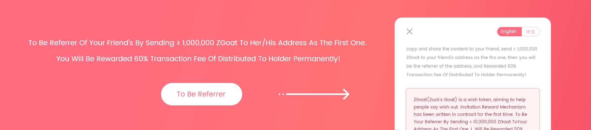

# ZGoat, The First Defi-Marketing Application With Big Business (Airdrop At The End)

[Click Buy ZGoat](https://exchange.pancakeswap.finance/#/swap)

.png>)

## 一、Defi-Marketing is Blank

Up to now, all current DeFi application designs are based on the idea of basic product, the method of defi-marketing is just community with low efficiency. What's more, the DeFi application design based on the idea of marketing is completely blank. The more product application, the stronger defi-marketing need. ZGoat will solve this problem and is the first Defi-marketing application with big business.

.png>)

## 二、Make DeFi-Marketing Easier

For any application of consensus economy, the stronger the consensus, the greater the value. The popularity of Defi has made the rapid development of cryptocurrency. However, it still faces many problems:

* The participation threshold for ordinary users is still high.
* The user experience is so bad.
* Low frequency

By entertaining, ZGoat makes the defi application more widely, frequency higher, entertaining more, and participation threshold lower.

Taking [WISH001](http://zgoat.org/#/Home) as an example, the first wish launched by a little girl on ZGoat platform was related with Zuckerberg's Twitter about Bitcoin. As the founder of the world's largest social platform, Zuckerberg has huge followings. But the little girl is a common person in the world. Connecting "Zuckerberg" with "little girl" through a wish has its own huge topic effect. On the other hand, users will be rewarded with ZGoat Token by supporting the wish, which is a further encourage for users to participate.

1. _**\[Entertainment] **_Help the little girl meet Zuckerberg;
2. _**\[Low threshold] **_Users only need to copy to comment, and they will get ZGoat reward;
3. _**\[High frequency] **_Everyone can make a wish with different ideas, generating high-frequency applications;
4. _**\[Second marketing] **_Huge participation can form new topic for marketing and ZGoat will gradually become the high efficient brand of defi-marketing;

As a result, any hot topic can be embedded in the wish list, such as "Wu Yifan event", that can be made a wish by someone, the theme such as "Kris Wu, ZhaNan". Another example, Zhengzhou Flood also can be made a wish, the theme such as "Zhengzhou Power".

ZGoat wishlist can combine the newest and hottest topic at any time, with high user participation and low threshold. Different from other products, which usually only have two or three Marketing Event. ZGoat can combine hot topics all the time, with various Marketing Event.

## 三、Big Business

Different from other product design, ZGoat is an innovative leading product based on the idea of marketing application, with small closed-loop business model. ZGoat has a big business profit model. According to market economics, for consensus-economy products, insufficient marketing topics often lead to an accelerated decline in profits and even makes product fail.

### 1.The basic profitability is 315 times than Shib

.png>)

At the beginning of the design, ZGoat cleverly integrated the marketing concept into the small closed-loop design of the product. As shown in figure above, the process is as follows:

* Generate a wish based on the current hot topics, and provide ZGoat rewards for users;
* Users participate simply and ordinary users can participate by entertaining;
* Airdrop rewards need to unlock by staking ZGoat LP, gaining transaction fee;
* Part of transaction fee is sent to the Marketing Management Account to ensure that there are enough ZGoat to support airdrop marketing activities without interruption;
* Huge participation forms new hot topics, making topic spread more widely;

According to Shib transaction data of CoinMarketCap, the 24h volume is $0.25 billion, with 2.22% price increase in the past 30 days. **For the ZGoat, assuming 24h volume is only 1% of Shib.**

|                    | Shib        | ZGoat          |
| ------------------ | ----------- | -------------- |
| 24h Valume         | 250,000,000 | 2,500,000      |
| 30Day Price Change | 2.22%       | 150%           |
| Investment Cost    | 1000        | 0              |
|                    |             |                |
| **Profit**         | **22.2**    | **17,500,000** |


Assuming that each user transfers $1,000 on average within 24h, the number of Shib participants is 250000, and the number of ZGoat participants is 1/100 of Shib, about 2500. The profit of the ZGoat is calculated as: (6% +1%) _ \* 0.25 billion _ \* 1% \* _(1+1/3)_  \* 30 \*  (1 + 150%) = $17.5 million, of which, 1% is the estimated proportion of holder reward of Marketing Management Account , and 150% is the estimated increase rate of currency price within 30 days according to a similar product model.


From the above model, ZGoat's basic profitability is hundreds of times than Shib. Assuming each person invests $1,000 on average, then the number of participants is 2500. The average profit is $17.5 million/2500 = $7000.**That is, the basic profitability of ZGoat is 7000/22.2=315 times than Shib.**

### 2.The core profit scene is like TikTok, in daily life

ZGoat aim is to help users say wishes out. Like TikTok, everyone wants to show himself, as well as to recognize and appreciate others. When the number of ZGoat holders reaches a certain value, the platform will open WISHLIST function, for user-defined wish, including text, graphic and video formats. Different from TikTok, the wish has a positive energy goal, which is against the feature of killing time.

According to long-tail theory, when product catches long-tail users, it will become a platform. Different from common DEFI application, usually only 1-2 core profit scene, ZGoat combines defi-marketing with entertainment to help users say wishes out, and others get reward by supporting wish. Different users make different wishes, that making ZGoat adopt hundreds of scenes. At the same time, wish can be user-defined by ordinary people to reduce the participation threshold of DEFI.

The process of wishlist is: Make A Wsh-> ZGoat Support-> User Participation-> User Receiving ZGoat Rewards. In the whole process, the platform will get profit, such as Tx Fee during the period of staking ZGoat, 50% of unclaimed reward transferred to Marketing Management Account, Commission Fee, the currency price raising...

Take a famous DEX data as comparison, ZGoat core profit data as shown below. Assuming scene using ratio is 20% of the DEX application.

|                      | Common  Project | ZGoat            |
| -------------------- | --------------- | ---------------- |
| Scene Number         | 2               | 10000            |
| Tx Volume Each Scene | 0.1 Billion     | 1000             |
| 30-Day Volume        | 6 Billion       | 0.06 Billion     |
| Tx Fee               | 30 Million      | 4.2 Million      |
| LP Unlock Profit     | 0               | 630w             |
| Aridrop Unclaim      | 0               | 120 Million      |
| Commission Fee       | 1/3             | 10%              |
|                      |                 |                  |
| **Total Profit**     | **10 Million**  | **28.5 Million** |


Assume that ZGoat staking for each wish is valued $1,000, then the volume of the 30-day wishlist  is: 10000/5_\*_30_\*_1000 = $60 million. Profit: (6% +1%)_ \* 0.06 billion _\* _(1+150%)+0.06 billion _ \* 20% +0.06 billion \* 10% = $28.5 million, of which, 1% is the estimated proportion of holder reward of Marketing Management Account , and 150% is the estimated increase rate of currency price within 30 days according to a similar product model. Proportion of  unclaim is assumed to be 20%, and proportion of commission fee is 10%.


Since the cost of this part is zero, this profit can be used for raising currency price or other marketing activities, forming a positive loop. On the other hand, with the increase of holders, the application scene will also increase, and the profits of this part will also rise, with big imagination.

### 3.Magic profit model: ROI = 120,000

For other DEFI product, early participants will get a strong price advantage, which seems not fair. As a better wish, Whoever brings profit should enjoy the highest percentage of profit. ZGoat's invitation mechanism will meet this demand well:

> 1. The mechanism is written into the decentralized contract, without human intervention, and is fair for everyone;
> 2. No matter early participants or later participants, the mechanism is the same standard.
> 3. In the past, people in Crypto can only make money by price rising of tokens or contracts. ZGoat's invitation mechanism may create a new profit way.

.png>)

For example, Address A is the referrer of Address B. Address A sends 10,000,000 ZGoat to Address B as the first one, then will be reward 60% transaction fee of distributed to holder permanently. Calculating with the current price of ZGoat, 10,000,000ZGoat values $1.

|                                                    | Address A               |
| -------------------------------------------------- | ----------------------- |
| Invitation cost                                    | 1000w ZGoat             |
| Reward rate                                        | 60%                     |
| Address B monthly transaction volume = 0           | -$1                     |
| Address B monthly transaction volume = $1,000      | $12                     |
| Address B monthly transcation volume = $100,000    | $1200                   |
| Address B monthly transcation volume = $10 million | $120000                 |
|                                                    |                         |
| **Return on Investment**                           | **Up to 120,000 times** |


According to invitation mechanism, if address B is a big-volume user, the transaction volume within 30 days is $10 million, then the Commission fee of address A is $12,000 or $6,000,** that means, a monthly return on investment is 120,000 times**. At the same time, address A can invite more users, which means, return on investment of address A will be so huge. Of course, if the user invited by address A has not transaction, address A will lose $1.


Who is the richest referrer with the new invitation mechanism? Just look forward. users can check referrer  information by [To Be Referrer](http://zgoat.org/#/Reward).&#x20;


[yao-qing-fan-yong-gui-ze.md](dai-bi/yao-qing-fan-yong-gui-ze.md)


#### &#x20;

### 4.Future profit model: more entity economy

The development of crypto, from Confused Era to DeFi Era, is still limited by many factors, and it is difficult to make a breakthrough in expanding the application of crypto for a long time. ZGoat may solve the current issue of crypto.&#x20;

At the beginning of the product design, ZGoat focused on "Marketing and Entertainment + Zero Fee DEX + Entertainment + Shopping", aiming at a long-term double-win situation and developinig entity economy of crypto. The total amount of ZGoat was 21,000 billion, and the initial burning was 11,000 billion. The decentralized invitation mechanism is applied for the first time, , and it was written into the intelligent contract. The Commission ratio was 60% , when the circulating total amount reaches 2100 billion, stop burning and update the transaction fee ratio.

As more real economies are applied in the future, the profit model will be more.

****

**ZGoat, started by the wish of a little girl, aims to make DEFI-marketing easier and  create a new era of crypto...**

****

**🔥 AirDrop Reward:**



[Click me](https://twitter.com/Goat22412341/status/1420290621319761920), then follow tweet and retweet, if the retweet gets more than 10 likes, you will get reward 1,000,000 ZGoat, only for top 500; if the retweet gets more than 100 likes, you will get reward 10,000,000 ZGoat, only for top 100.



[Click me](https://t.me), Join our Telegram group to obtain reward, or invite friend to join our Telegram group, reward 10,000ZGoat per each user, Total reward 1,000,000 ZGoat at most.



[Click me](http://zgoat.org/reward), then obtain your privite link and picture, share to your Wechat Moment. if the Moment gets more than 30 likes, you will get reward 1,000,000 ZGoat, only for top 1000; if the Moment gets more than 300 likes, you will get reward 100,000,000 ZGoat, only for top 500.&#x20;

Tips:

1\)You need add the assitant wechat id: **zgoat\_org**;

2\)when you finish the task, give the screenshot to the assitant;



Tips:

* You can only participate one of the above activities for one address. If you participate more than one activities at the same time, only the highest reward will be calculated;
* All airdrop rewards are locked and need to be unlocked by staking LP;

