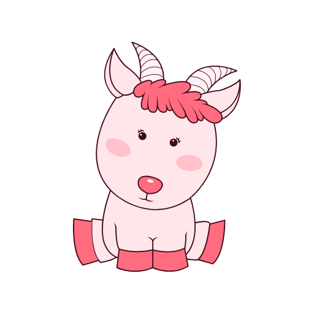

# What are the super profit models of ZGoat, the leader of the marketing track?

[Click buy ZGoat](https://exchange.pancakeswap.finance/#/swap)

## 一、The marketing track is completely blank

Encrypted currency has experienced four stages of development since its birth:**2009-2013 chaos era, 2013-2017 speculation era, 2017-2021 Gold trial era, 2021-? Empower the era of real economy**.

In the chaotic era, encrypted currency users did marketing through small groups of people and people, with little effect. By the ICO fire in 2017, the encryption industry entered the era of speculation, and conducted marketing through the crazy "ten thousand times return" of ICO, A flash in the pan due to the lack of application implementation; With the popularization of Defi applications, the encryption industry has entered the trial period, extending from the lending field to the fields of DEX, revenue aggregation, asset data, cross-chain, prediction machine, etc, the marketing mode is gradually transformed into the community mode.

The applications of the encryption industry are all designed based on the track of specific basic products, while the track based on marketing promotion is completely blank. The product track is full of varieties, but the marketing track is in blue sea. The appearance of ZGoat will fill this gap and become the first product of the marketing track.

## 二、Make Defi-Marketing Easier

As a typical application of consensus economy, the larger the consensus, the greater the value. The popularity of Defi project has driven the rapid development of encrypted currency. However, it still faces many problems:

* The participation threshold for ordinary users is still high.
* The operation process is also very inconvenient
* Low participation frequency

Through the form of entertainment, ZGoat makes the user group more extensive, the frequency of use is more frequent, the entertainment is stronger, and the participation threshold is lower.

To [WISH001](http://zgoat.org/#/Home) For example, the first wish launched by the little girl through the platform was "Zuckerberg's Bitcoin Twitter". As the founder of the world's largest social platform, Zuckerberg brought huge traffic. But the little girl is the most common nobody in the world, because she wishes to connect "Zuckerberg" with "little girl", not only the topic has its own huge contrast effect. Through participation, ZGoat is rewarded to further encourage users to participate.

1. _**\[Entertainment\]**_Help the little girl talk to Zuckerberg, form Entertainment;
2. _**\[Low threshold\]**_Users only need to copy the message, and they will have the opportunity to get rewards;
3. _**\[High frequency\]**_Everyone can initiate a wish, with different wishes, generating high-frequency applications;
4. _**\[Secondary marketing\]**_Hot wishes can form secondary marketing and will gradually monopolize the marketing market of encryption industry;

Similarly, any hot topic can be embedded in the wish list, such as "Wu Yifan event" making a wish -- Wu withdrew from the entertainment circle, "Zhengzhou flood" making a wish -- Zhengzhou held on, making ZGoat always in the newest and hottest topic, high user participation and low threshold. Different from other products, there are usually only two or three hot topics. ZGoat can produce thousands of hot topics, which are hot topics all the time.

## 三、Super profit model

Different from many projects driven by community pure consensus such as dog coin and shib, ZGoat is an innovative leading product of marketing track based on the small closed-loop business model concept of marketing-profit-remarketing, it has a super profit model. According to market economics, for many products lacking marketing topics in the encryption consensus industry, the lack of marketing topics often leads to the accelerated decline of profits, and even cannot make ends meet.

### 1.The basic profitability is 315 times that of shib

At the beginning of the design, ZGoat skillfully integrated the marketing concept into the small closed-loop design of the product, as shown in the above figure, which can be simply summarized into the following process:

* Generate a wish list based on the current social hot topics, and provide ZGoat rewards for the operation account;
* User participation is simplified and entertaining to ensure that ordinary users outside the industry can also participate;
* Users receive airdrop rewards, and unlock them by purchasing ZGoat to form LP, increasing the currency price and generating handling fees;
* Part of the income of the handling fee is transferred to the Operation account to ensure that there are enough ZGoat in the Operation account to conduct airdrop marketing without interruption;
* Generate new hot topics and form a small closed loop, making ZGoat always in the hottest topic;

According to the non-small shib transaction data, the 24-hour turnover was $0.375 billion, calculated by 2.22% increase in the past 30 days. For the ZGoat project, assuming the initial heat is only 20% of shib.

|  | Shib | ZGoat |
| :--- | :--- | :--- |
| 24h Valume | 3.75亿 | 0.75亿 |
| 30Day Price Change | 2.22% | 150% |
| Investment Cost | 1000 | 0 |
| **Profit** | **22.2** | **5.25亿** |


Assuming that the 24-hour turnover contributes US $1,000 per person on average, the number of Shib participants is 375000, and the number of ZGoat participants is 1/5, about 75000, then one month later, invest in Shib users and get a profit of $22.2. The profit of the ZGoat operating account at zero cost is calculated as:\(6% +1%\)  _0.375 billion_  20% _\(1+1/3\)_ 30 \(1 + 150%\) = USD 0.525 billion, among them, 1% is the estimated proportion of dividends in the operating account, and 150% is the estimated increase rate of currency price within 30 days according to a similar product model.


From the above model, ZGoat's basic profitability is hundreds of millions of times that of Shib. Even if all the profits are distributed to all users through AirDrop, it is also assumed that each person invests $1,000 and the number of participants is 75000, then the average profit of the operating account is $0.525 billion/75000 = $7000 per person.**That is, the basic profitability of ZGoat project is 7000/22.2=315 times that of shib project.**

Similarly, from the perspective of cost**,**The profits of ZGoat's operating account can be used for uninterrupted airdrop marketing. Assume that the number of airdrops within 30 days is 10, and each user will be rewarded with 10 dollars each time, the cost required within 30 days is: 10\*10\*30\*75000=0.225 billion, accounting for only 42.8% of the operating account profit, the operating account has enough profit space for currency price stretching or other marketing activities.

### 2.The core profit scenario is like TikTok, which is thousands of times that of ordinary projects.

ZGoat is designed to help users express their wishes. Like TikTok, everyone has the need to express himself, and also has the need to recognize others and appreciate others. When the number of ZGoat holders reaches a certain value, the platform will open WISHLIST user-defined wish list function, gradually upgrading from text to graphic form or even video form. Different from TikTok, the wish list has a certain goal, which abandons the feature of TikTok's pure killing time.

According to the long tail theory, when a product can catch long tail users, it will become a platform-level product. For common DEFI projects, there are usually only 1-2 core profit scenarios, so there are great limitations. ZGoat takes marketing and entertainment as the entry point to help users express their wishes and gradually realize their wishes through the participation of other users. Different users have different wishes and different application scenarios. At the same time, users outside the industry can be personalized to reduce the participation threshold of DEFI projects.

The general process of releasing wish list is: releasing wish-&gt; raising ZGoat support-&gt; User participation-&gt; User receiving ZGoat rewards. In the whole process, the platform will generate many forms of benefits, such as the commission income during the period of raising ZGoat, 50% of users who have not received rewards will be transferred to the Operation account, wish single Commission, the currency price during the unlock process of airdrop rewards has increased...

|  | Common  Project | ZGoat |
| :--- | :--- | :--- |
| Number of scenarios | 2 | 10000 |
| Scenario usage | 100% | 20% |
| Scenario quota | 0.1 Billion\(DEX\) | 1000 |
| 30-day quota | 6 Billion | 0.06 Billion |
| Handing fee profit | 3000w | 840w |
| LP unlock increase | 0 | 1260w |
| Aridrop not received | 0 | 1200w |
| Platform Commission | 1/3 | 20% |
|  |  |  |
| **Total profit** | **1000w** | **4500w** |


Assume that the scenario usage rate of ZGoat is 1/5 of that of common projects, and the amount of ZGoat raised for each wish order is ZGoat worth $1,000 \(refer to the total reward amount of a single live broadcast of common online celebrities in Tik Tok\), then the amount of the 30-day wish list raised is: 10000/5_30_1000 = USD 60 million. Revenue:\(6% +1%\) _0.06 billion_  2_\(1+150%\)+0.06 billion_  20% +0.06 billion \* 20% = USD 45 million, among them, 1% is the estimated proportion of dividends in the operating account, 150% according to a similar product model, the estimated increase rate of currency price within 30 days; The part without rewards is assumed to be 20%, and the proportion of commission is 20%.


Since the cost of this part of income is zero, it is net income, thus this part of profit can be used for more currency price stretching or other marketing activities, forming a virtuous circle. On the other hand, with the increase of currency users, the application scenarios will also increase, and the profits of this part will also rise, which makes imagination very large.

### 3.Additional profit model: return on investment up to 120,000 times

In previous DEFI projects, early participants will gain a strong enough price advantage, which seems not very fair. Who brings the real users should enjoy the highest percentage of handling fees and dividends. ZGoat's commission invitation mechanism well meets this demand:

> 1. The mechanism is written into the decentralized contract, without human intervention, and is fair and just;
> 2. No matter early participants or late participants, the commission mechanism is in the same standard and has no first-mover advantage.
> 3. In the past, the encrypted money industry could only make money by rising the price of tokens or short contracts. ZGoat's commission invitation mechanism may have created a brand-new profit model. Due to the large proportion of commission, it is tentatively set to 60% of the share of cash holding. If high-quality trading users can be invited, the profit will be very objective.

|  | Address A |
| :--- | :--- |
| Input cost | 1000w ZGoat |
| Input cost value | $1 |
| Commission rate | 60% |
| Address B trading platform | Pancakeswap |
| Address B monthly transaction volume = 0 | -$1 |
| Address B monthly transaction volume = USD 1,000 | $12 |
| Address B monthly transcation volume = USD 100,000 | $1200 |
| Address B monthly transcation volume = USD 10 million | $12w |
|  |  |
| **Return on Investment** | **Up to 120,000 times** |


According to the Commission invitation rules, if Address A is the first to donate more than or equal to 1000 thousand zgoats to address B, address A will become the recommender of address B forever. In the future, 1.2% or 0.6%de will be charged to address A for each transaction of address B. At the current currency price, the approximate cost of 1000 million zgoats is USD 1. If address B is a large account, the transaction volume in 30 days is USD 1000 million, then the Commission for the handling fee of address A is USD 12,000 or USD 6,000,**It is equivalent to a monthly return on investment of 120,000 times**. For ordinary users, the 30-day transaction volume is USD 10,000, and the Commission for handling fees is about USD 120 or USD 60,**Equivalent to a monthly return on investment of 120 times**. At the same time, address A can invite and donate to multiple users. If the invited users produce considerable transactions, the return on investment of address A will be A large amount of digital income.

Of course, if the user invited by address A does not generate A transaction, address A will lose USD 1.




####  

### 4.Future profit model: empower more real economy

The development of encrypted currency from chaos era to financial product era is still limited to the field of encrypted currency, and it is difficult to make a breakthrough in expanding the application of encrypted currency. The emergence of ZGoat may solve the current dilemma of encrypted currency. In terms of ecological layout, ZGoat will gradually empower the real economy and win-win for a long time.

At the beginning of the product design, ZGoat focused on "Marketing and Entertainment + zero handling fee exchange + entertainment consumption + e-commerce platform", aiming at a long-term win-win situation and devoting itself to empowering the real economy. The total amount of ZGoat issued was 210,000 billion, and the initial burning was 110,000 billion. For the first time, the decentralized Commission invitation system was adopted, and it was written into the intelligent contract. The Commission ratio was 60% of the bonus of the holder, when burning to the remaining amount of 2100 billion, stop burning and update the transaction handling fee ratio.

As more real economies are empowered in the future, the profit model will be more objective.

\*\*\*\*

**ZGoat, originated from the wish of a little girl, is based on making DEFI marketing entertaining and striving to create a new era of encrypted currency...**

\*\*\*\*

**🔥 Egg link:**

1\) click the Share button and forward this article to Twitter. If you win more than 10 likes, you will get 1 million ZGoat rewards, limited to the top 500; If you win more than 100 likes, you will get 10 million ZGoat rewards, top 100. First come first served

2\) click the Share button and forward this article to the Telegraph group or WeChat group. If the number of clicks on the sharing link exceeds 500, you will get 1 million ZGoat rewards, which is limited to the top 500; if you win more than 5,000 likes, you will get 10 million ZGoat rewards, limited to the top 100. First come first served

3\) click the Share button and forward this article to WeChat Moments. If you win more than 30 likes, you will get 1 million ZGoat rewards, which is limited to the top 500; if you win more than 300 likes, you will get 10 million ZGoat rewards, limited to the top 100. First come first served

Tips:

* You can only participate in one of the three activities above the same address at most. If you participate in multiple activities at the same time, the highest reward will be calculated;
* All airdrop rewards are locked and need to be unlocked by pledge LP;

