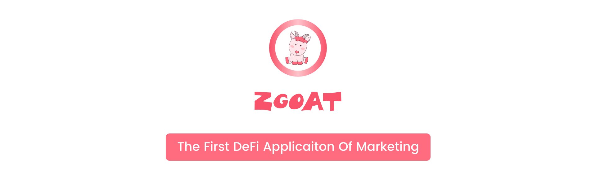

# Overview

ZGoat is the first Defi application of Marketing. By entertaining, user can make defi-marketing easier. With ZGoat, users can make a wish, and obtain ZGoat Token reward by supporting other's wish. In future, user can use ZGoat Token to join more ecological application, such as deposit, mining, bridge, business cooperation, zero-fee exchange, entertainment, shopping, etc.

As the first DeFi applicaiton based on the marketing concept, ZGoat will greatly improve the marketing efficiency in cryptocurrency. ZGoat has several features, such as higher frequency, more entertaining, and a lower threshold for participation.

**Main Innovations:**

1. Decentralized Invitation Mechanism
2. Eatzero Reward
3. Uninterrupted Wishlist Airdrop
4. Zero Fee Decentralized Exchange
5. Combine Entity Economy With Cryptocurrency

\*\*\*\*

**Main Functions:**

1. Participate wish
2. Make A Wish
3. Invitation Mechanism
4. Multi-dimensional Mining
5. Zero Fee Decentralized Exchange
6. Entertainment
7. Shopping

