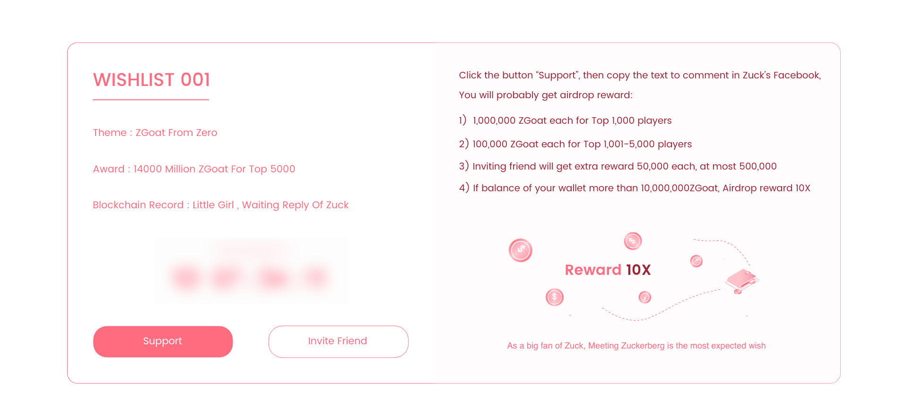

# Wishlist

Wishlist is the main function of ZGoat's application, which any user or application owners can participate or make a wish. The main function of Wishlist is to solve the problem of low efficient marketing in crypto. On the other hand, Wishlist can help ordinary users to participate Defi with lower threshold, more entertainment, higher frequency. 

What's more, Users can make user-defined wish in the next version, with better user experience.

### 1. How to support wish? 

Users can visit [zgoat.org](http://zgoat.org) website, select a wish and click **\[support\]** to support wish. Only the text type is supported, and donations function is not supported in current version. In the next version, the wishlist support feature will be optimized in the following:

* Support ZGoat donations to increase the reward amount;
* Support reward batches for one wish;
* Support text version, picture version and video version at the same time ;
* Support user-selected function, that users can choose the prefer solution to support ;



### 2. How to make a wish? \(Not available\) 

Click the **Make A Wish** button, and make a wish based on operation guide. However this function has  not yet listed. When user makes a wish, user has to stake certain amount of ZGoat, without transation fee because of white list mechanism.

Making a wish has four stages:

1. Make a wish and wait friends for support with ZGoat;
2. After the ZGoat support is completed, users start to participate \(wish with the highest support may be recommended to Homepage\);
3. Participation completed, waiting for being sent rewards;
4. Set the validity period of the reward. If users do not obtain the reward exceed the validity period, 50% of the reward will enter the Operation Management Account and 50% will be burnt;

_Tips: ZGoat obtained by AirDrop, wishlist reward, marketing activities, etc. are locked and can be unlocked by staking LP._

