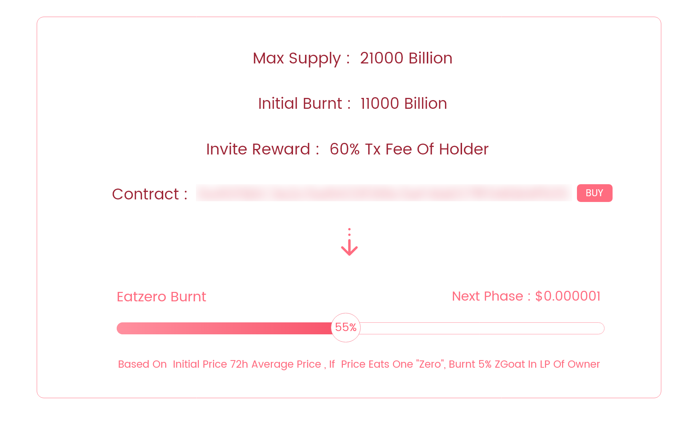
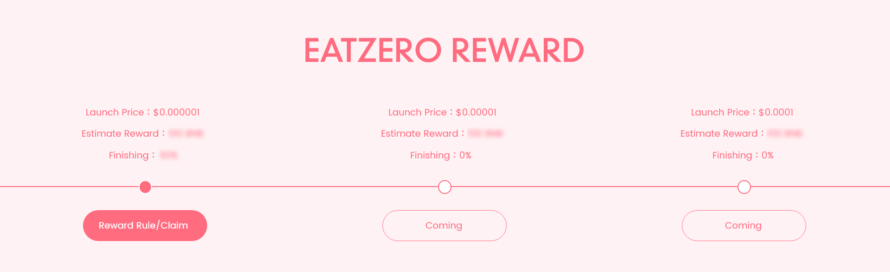

# 吃零分红规则

一个共识经济产品离不开用户的大力支持，加密货币领域的产品有一个很重要的参数：币价

**见证高光时刻！生活要有仪式感！**

当币价上升时，所有参与者获利的同时，当币价每增长10倍，相当于币价数值少了一个零时，为了庆祝大家的共同努力成果。

EatZero 奖励规则描述如下：

管理员账号将从LP池子取出5%份额，获得ZGoat和BNB，其中ZGoat转入黑洞地址进行销毁，80%的BNB根据用户的共识值比例均分，20%的BNB根据用户的总奖励数量比例均分。

* 当前币价：$0.0000001
* 预估分红：100BNB
* 触发币价：$0.000001

Tips: 

* 共识值跟质押的LP数量及质押时间相关（取最新30天作为依据）
* 总奖励数量与邀请朋友的奖励相关

