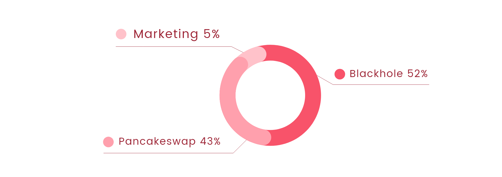

# Tokenomics

Zuck's Goat token is ZGoat, the total supply is 21,000 billion, the initial blackhole burnt is 11,000 billion, 5% for Operate Management Account, that is used for marketing activities such as airdrop, wish reward, Eatzero Reward, etc, the remaining of all is used to add liquidity on Pancakeswap.

6% of transation between users is charged, of which 1% is used to add LP, 3% is sent to Operate Management Account, 1% is sent to the blackhole address, and 1% is distributed to holders.

11% of transation On Pancakeswap is charged,  of which 1% is used to add LP, 6% is sent to Operate Management Account, 2% is sent to the blackhole address, and 2% is distributed to holders.

### Invitation Reward Rules 

For each transaction, if there is a referrer, 60% transation fee of distributed to holder will be sent to referrer as reward.

### Stop Burnt: 

When amount of black hole reaches 18,900 billion, that is, the remaining total amount is 2100 billion, black hole burnt stops, and transation fee ratio will be adjusted.

For more information about Operate Management Wallet, pay attention to AirDrop Activities.

[Click to buy ZGoat](https://exchange.pancakeswap.finance/#/swap)  

