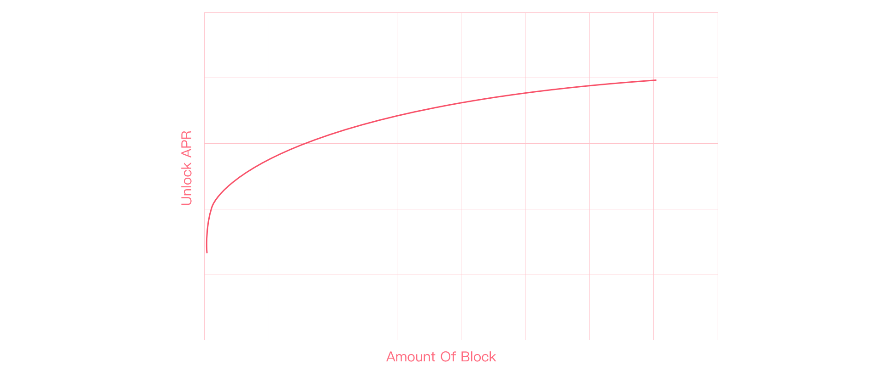

# Q & A

## 1.Why the Unlock APY grows so fast

According to the formula,&#x20;

**APR = **Time ^ 0.125 \*  K1 \* 100%


_K1_ is a constant, that can be optimized according to market feedback.


With amount of block increasing, the value of APR will grow quickly. Note that, because of the max speed, APR has a limitation of maximum

## 2.How To Unlock ZGoat&#x20;

According to Unlock rule, ZGoat obtained by Airdrop, wishlist reward, marketing activities, etc. is locked and can be unlocked by staking LP.


[5.-ru-he-jie-suo-zgoat.md](xin-shou-jiao-cheng/5.-ru-he-jie-suo-zgoat.md)


## 3.Why did my swap fail

1、Check whether there is enough BNB for gas fee

2、Check the Slippage Tolerance, the advised Slippage Tolerance ≥ 12%

3、If your wallet have locked ZGoat, the max amount for swap must be cut off the part of locked ZGoat.

4、Other factor, such as wrong network, node delay
