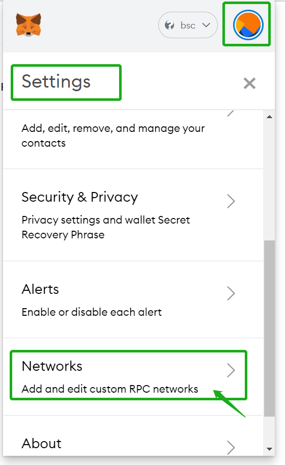
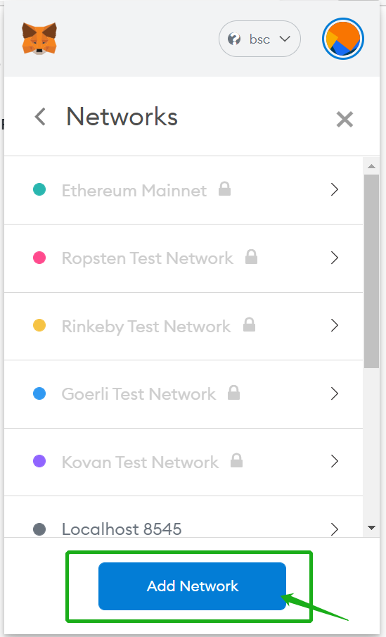

# 1.How to install MetaMask wallet in browser and configure the mainnet

MetaMask download website：[https://metamask.io/](https://metamask.io/)

Click on the metamask and select ‘Settings’→ ‘Networks’, Add ‘Network’, and set according to the following parameters. After that, click ‘save’.

**Parameters：**

Network name: BSC

RPC URL:[https://bsc-dataseed.binance.org/](https://bsc-dataseed.binance.org/)

Chain ID:56

Symbol \(optional\): BNB

Block Explorer URL\(optional\):[https://www.bscscan.com/](https://www.bscscan.com/)

