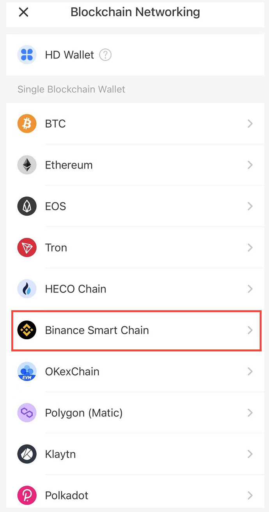

# 2.How to create a wallet and enter ZGoat official website on mobile

1. First of all, you need a decentralized wallet that support zgoat.org, such as Math, ONTO, Bitkeep, imToken, TokenPocket, etc. We take TokenPocket as an example.

2. Create a wallet on a public chain, take the BSC chain as an example.

3.Create a password and a memonic phrase, write the memonic phrase on paper and keep it properly! The memonic phrase is the private key to the wallet. The wallet will lose once the memonic phrase is gone. No third party can help.

4.You can enter the BSC chain wallet interface page by entering the wallet memonic phrase in sequence correctly.

5.After the wallet is successfully created, click "Discover" and type [zgoat.org](http://zgoat.org) in the search bar to enter the transaction interface.

