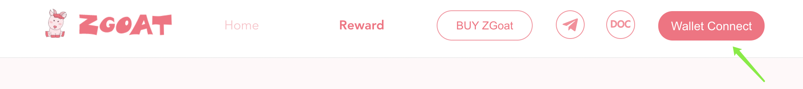
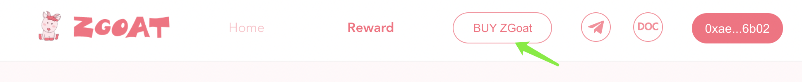
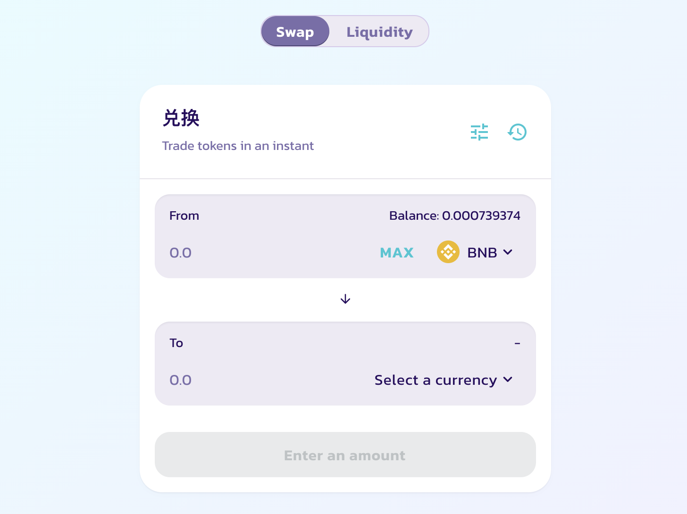

# 1.How to buy ZGoat


make sure you have a BSC wallet before start, if you don't know how to create a wallet, you can click this tutorial on PC: [How to install MetaMask wallet in browser and configure the mainnet](https://doc.zgoat.org/qi-ta/xin-shou-jiao-cheng/0.how-to-install-metamask-wallet-in-browser-and-configure-the-mainnet), or click the tutorial on mobile: [How to create a wallet and enter ZGoat official website on mobile](https://doc.zgoat.org/qi-ta/xin-shou-jiao-cheng/00.how-to-create-a-wallet-and-enter-zgoat-official-website-on-mobile)


### 

### Step 1: Connect Wallet

Click \[Wallet Connect\] to Connect to BSC Wallet address

### Step 2: Buy ZGoat

Click \[BUY ZGoat\] to enter PancakeSwap to buy ZGoat.

### Step 3: Swap

Enter the amount of ZGoat you want to buy, and click \[Swap\] to swap. make sure all information is correct, then click \[confirm\]. 

Note that,

1. Little BNB is needed in your wallet for gas fee
2. You can buy at most 210,000,000,000 ZGoat because of the limitation of ZGoat contract
3. Maybe you need set Slippage Tolerance = 12% or more, to make sure to swap successfully.

After swaping successfully, you can view detail transaction information in the corresponding browser and the amount of ZGoat in the wallet balance.

