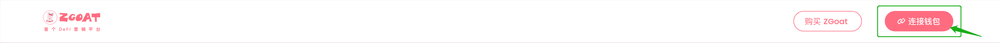
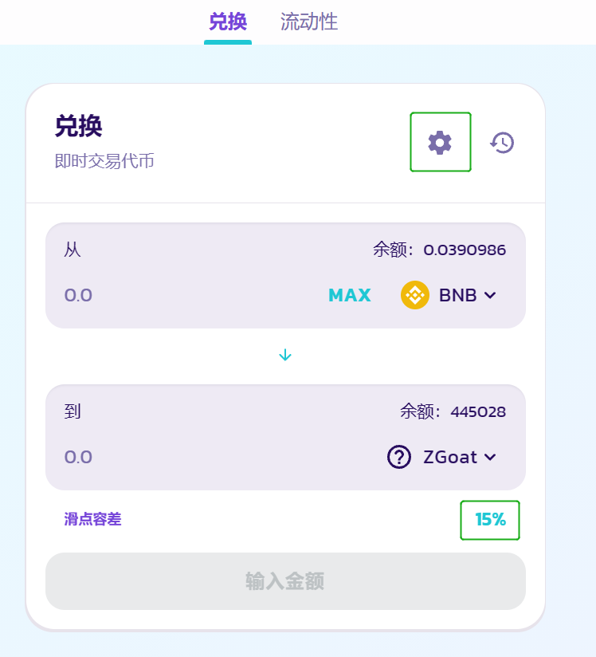

# 3.如何购买ZGoat


开始之前确保你有一个BSC钱包，如果你不知道如何创建钱包，你可以点击PC教程 ：[如何在浏览器安装MetaMask钱包并配置网络](1.-ru-he-she-zhi-qian-bao.md)或者手机教程:[手机端如何创建钱包并进入ZGoat交易页面](2.-shou-ji-duan-ru-he-chuang-jian-qian-bao-bing-jin-ru-mdex-jiao-yi-jie-mian.md)


**第1步：连接钱包**

点击 \[ 连接钱包 ] ，弹出小狐狸钱包先选择BSC网络再选择你的账户

**第2步：购买ZGoat**

点击 \[ 购买 ZGoat ] 跳转至 PancakeSwap 兑换页面

_输入你要购买的ZGoat数量，点击 \[Swap] 兑换，确认所有信息无误后，点击 \[确认]  （请确保你的钱包里足够的BNB）_

_注意：_

1. 交易时请确保钱包中有一定数量的BNB充当gas费
2. 由于ZGoat的合约规则，最多可买入210,000,000,000 ZGoat，超过将提示错误
3. 建议滑点设置为 ≥ 15% ，以确保交易成功

**第3步：兑换成功  查看结果**

确认兑换后，可在相应浏览器查看交易状态，在钱包中查看到兑换成功的ZGoat数量

Tips:

若兑换失败，可能原因有：

*   1、检查gas费是否足够

    2、检查滑点, 建议设置 ≥ 15%

    3、钱包余额的ZGoat是否有未解锁的部分，若有，最大可交易数量需减掉该部分数量.

    4、其他原因，比如网络错误，节点延迟等等

