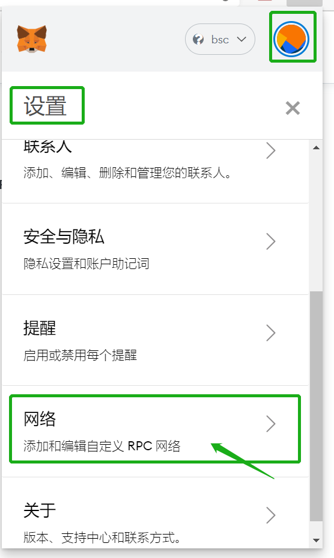
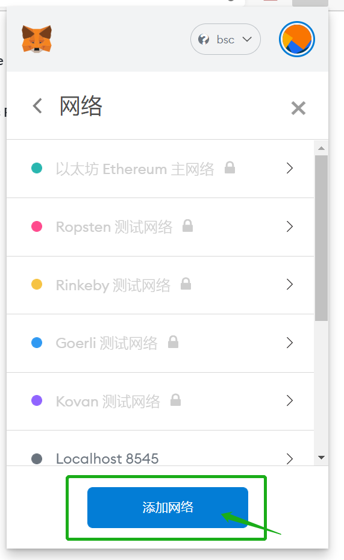

# 1.如何在浏览器安装MetaMask钱包并配置网络

MetaMask下载链接：[https://metamask.io/](https://metamask.io/)

点击MetaMask中 \[ 设置 \]-\[ 网络 \]，点击\[ 添加网络 \]，根据以下参数进行设置，设置完点击 \[ 保存 \] 即可

#### \*\*\*\*

### **参数**：

网络名称：BSC

新增RPC URL：[https://bsc-dataseed.binance.org/](https://bsc-dataseed.binance.org/)

链ID：56

符号（选填）：BNB

区块浏览器URL（选填）：[https://www.bscscan.com/](https://www.bscscan.com/)

配置完参数点击 \[保存\] 即配置成功

