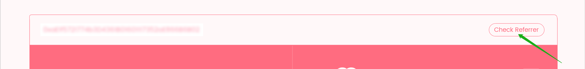
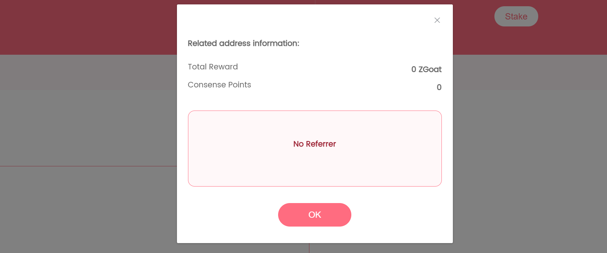

# 2.如何成为推荐者

#### 第1步：粘贴推荐文案给好友

点击 \[To Be Referrer\]，一键复制推荐文案内容，粘贴给微信、Telegram、Facebook等好友

#### 第2步：获得并检验好友地址是否已被推荐

获得好友地址后，点击\[Check Referrer\] ，查询好友地址是否有推荐人：若没有推荐人，可继续推荐，成为此地址的推荐人（继续第3步）；若有推荐人，则无法推荐成功！


 成功推荐好友必须符合以下条件：

📍 被推荐的好友地址没有推荐人

📍 推荐时需转≥1,000,000 ZGoat


#### 第3步：给好友地址转≥1,000,000 ZGoat

在 MetaMask 上给好友的地址转≥1,000,000 ZGoat，确保交易成功

#### 第4步：交易成功后，验证好友地址是否已被推荐成功

点击 \[Check Referrer\] ，输入交易的好友地址查询

