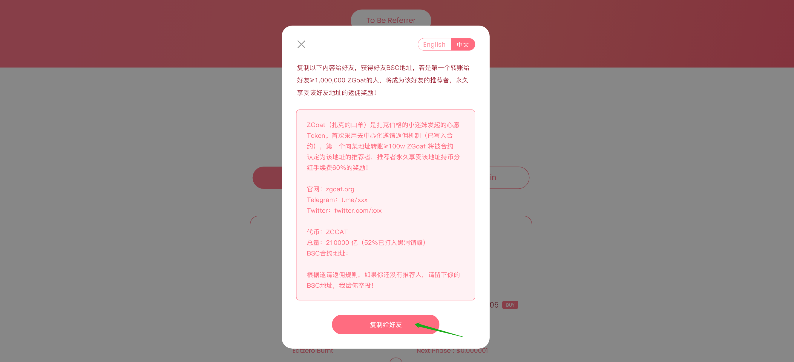

# 4.如何成为推荐者？

#### 第1步：复制推荐文案发送给好友

点击 \[ 成为推荐人 \]，一键复制推荐文案内容，发送给微信、Telegram、Facebook等好友。

#### 第2步：查询地址是否已被推荐

点击\[ 查询推荐人 \] ，查询好友地址是否有推荐人：若没有推荐人，可继续推荐，成为此地址的推荐人


 成为推荐人需符合以下条件：

📍 被推荐的地址没有推荐人

📍 推荐时需转≥1,000,000 ZGoat


#### 第3步：给好友地址转≥10,000,000 ZGoat

给好友的地址转≥10,000,000 ZGoat，确保交易成功

#### 第4步：交易成功后，验证好友地址是否已被推荐成功

点击 \[ 查询推荐人 \] ，输入交易的好友地址查询  好友地址的推荐者地址将会显示你的地址

