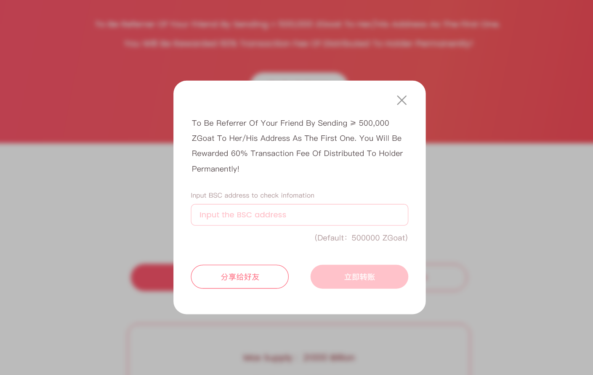
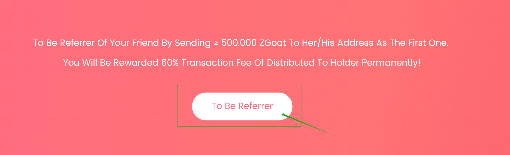

# 4.How to be referrer


make sure you have a BSC wallet before start, if you don't know how to create a wallet, you can click this tutorial on PC: [How to install MetaMask wallet in browser and configure the mainnet](https://doc.zgoat.org/qi-ta/xin-shou-jiao-cheng/0.how-to-install-metamask-wallet-in-browser-and-configure-the-mainnet), or click the tutorial on mobile: [How to create a wallet and enter ZGoat official website on mobile](https://doc.zgoat.org/qi-ta/xin-shou-jiao-cheng/00.how-to-create-a-wallet-and-enter-zgoat-official-website-on-mobile)


Decentralized Invitation Mechanism has been written into the contract, that is, if Address A sends  more than 10M ZGoat to Address B as the first one, then Address A is the referrer of Address B permanently. Then, for each transaction of Address B, 60% transation fee of distributed to holder will be sent to Address A as reward.

If you want to be referrer, make sure the address has no referrer. You can check the information  by clicking \[Check Referrer] button, shown as below:

If an address has no referrer, you should send more than 10M ZGoat to the address as soon as possible, in order to make sure you are the first.

On the other hand, you can copy the recommended text by click  \[To Be Referrer] button, and share to friends, shown as below, to obtain more high-quality address for being referrer.

When you finished being referrer, you can click \[Check Referrer] button for verifying whether your address is the referrer.
