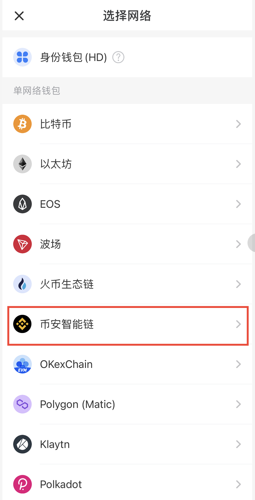
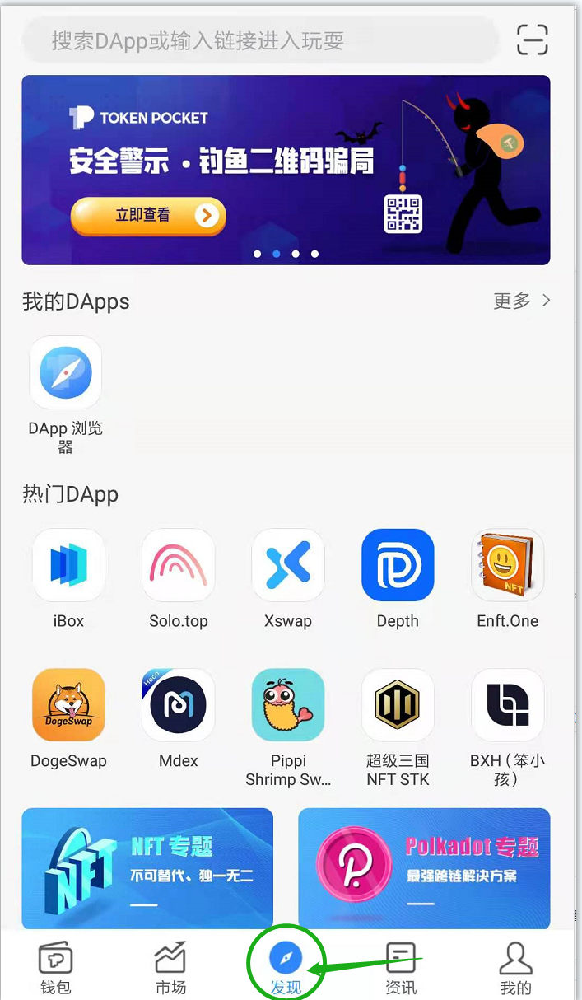

# 2.手机端如何创建钱包并进入ZGoat 交易界面

1.首先，您需要一个支持 ZGoat.org 的去中心化钱包，可下载火币钱包、ONTO、Bitkeep、imToken、TokenPocket等等。我们以 TokenPocket为例：

2..选择相应的公链创建钱包，我们以 BSC 生态链为例

3.创建密码和助记词，把助记词写在纸本上并一定保存好！助记词就是钱包私钥，一旦丢失钱包将永远无法打开，任何第三方都无法帮忙，请务必妥善保存。

4.依次按顺序输入钱包助记词确认无误后，即可进入到 BSC 链钱包界面

5.创建钱包成功后，点击，“发现”，在搜索栏输入 [ZGoat.org](http://zgoat.org)  进入交易界面。

