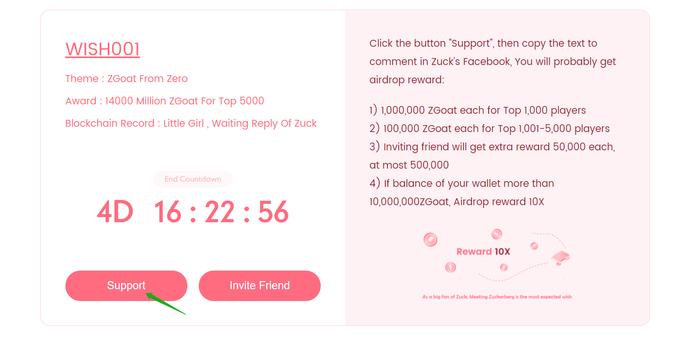
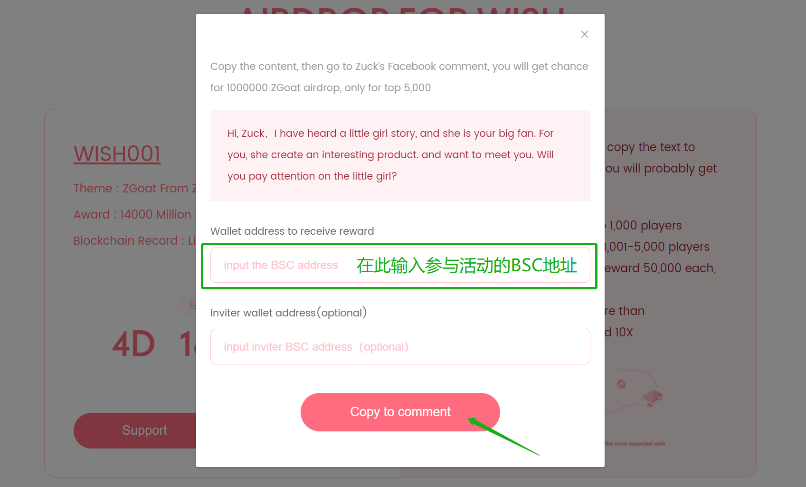

# 3.How to support wish for reward

Take wish001 as an example:

### Step 1: Copy Content 

Click \[Support\], then enter the BSC address for supporting wish, and click \[Copy To Comment\] To Copy content for comment in Zuckerberg's Facebook .

### \[图片改为全英文\]

### Step 2: Comment

When click \[Copy to comment\] button, then switch automatically to the corresponding page of the Zuckerberg \(maybe need VPN\). Then paste comment content, supporting wish is done.

\(Image\)【缺少在zuckerberg下留言的图例】


When you finished, whether you obtain reward will show on the official website about  several days later.


### Step 3: Claim

When Wish001 ends, you can click[ WISH REWARD- WISH001](http://zgoat.org/reward%20)-\[Claim\] button to claim the REWARD.

\[ Image\]



