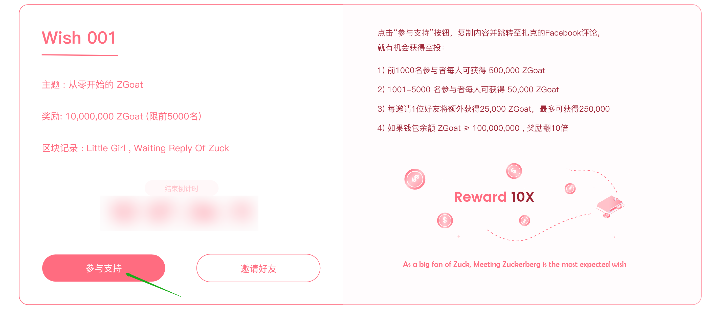

# 5.如何参与心愿单？

以 Wishlist001 为例：

#### 第1步：复制评论内容

点击 \[ 参与支持 \] ，输入参与心愿活动的BSC地址，点击 \[ 复制并前往评论 \] 复制评论内容

#### 第2步：评论

自动跳转至Zuckerberg的对应页面后（需翻墙），粘贴评论内容 ，即参与成功

（图片）


评论完成之后，几天后将会在官网显示是否可以领取奖励


#### 第3步：领取奖励

心愿单活动结束后，即可点击WISH REWARD- WISH001-\[ 领取 \]，领取奖励！

_（已连接钱包的地址与参与活动的钱包地址一致）_

Tips:

1.奖励将在评论完成一段时间后进行发放，请耐心等待

2.对于同一钱包地址，评论奖励只有一个，邀请奖励可以多个

📍  领取到的ZGoat属于待解锁的代币，需要质押LP解锁~



