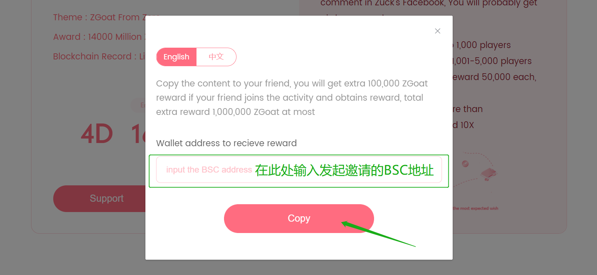

# 4.如何邀请朋友参与心愿单

以Wishlist001 为例：

#### 第1步：一键复制内容给好友

点击 \[Invite Friend\] ，输入参与心愿活动的BSC地址，点击 \[Copy\] 复制内容给好友

被邀请好友进行以下操作

👇👇 👇👇

#### 第1步：好友输入BSC地址

好友需点击内容中的链接，输入自己的BSC地址，点击 \[Copy To Comment\] 跳转至对应评论页面（需翻墙）

（图片）

#### 第2步：评论

跳转至Zuckerberg的对应动态页面后，粘贴评论内容 ，即参与成功

（图片）


程序猿小姐姐爬取数据的时候只识别每位参与者的第1条评论，请勿评论多条~


#### 第3步：领取奖励

心愿单活动结束后，即可点击WISH REWARD- WISH001-\[Claim\]，领取奖励！

_（已连接钱包的地址与参与活动的钱包地址一致）_

（图片）

📍  领取到的ZGoat属于待解锁的代币，需要质押LP解锁~



