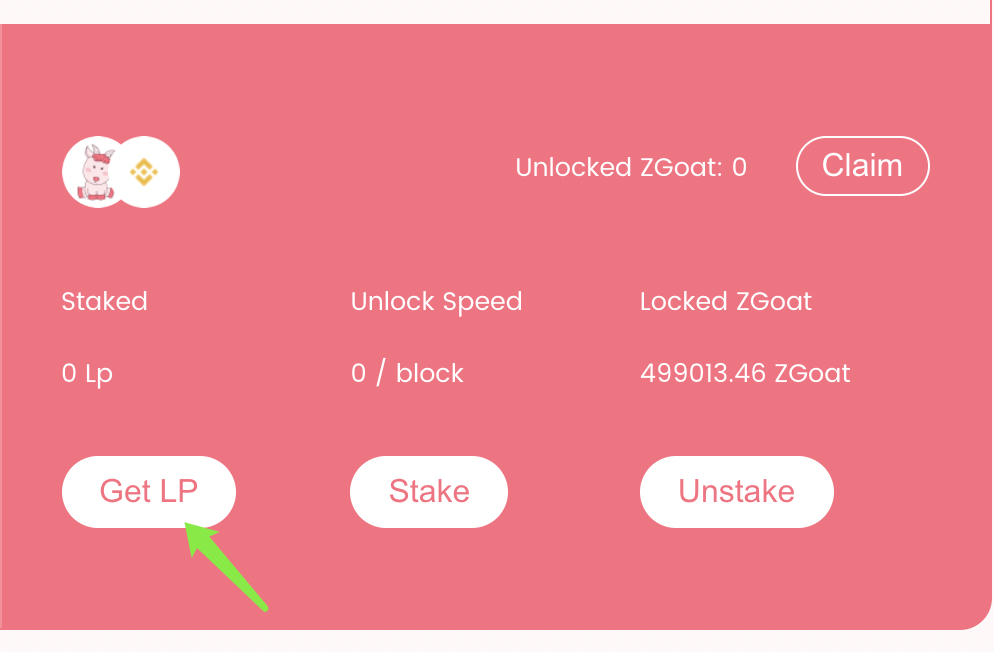
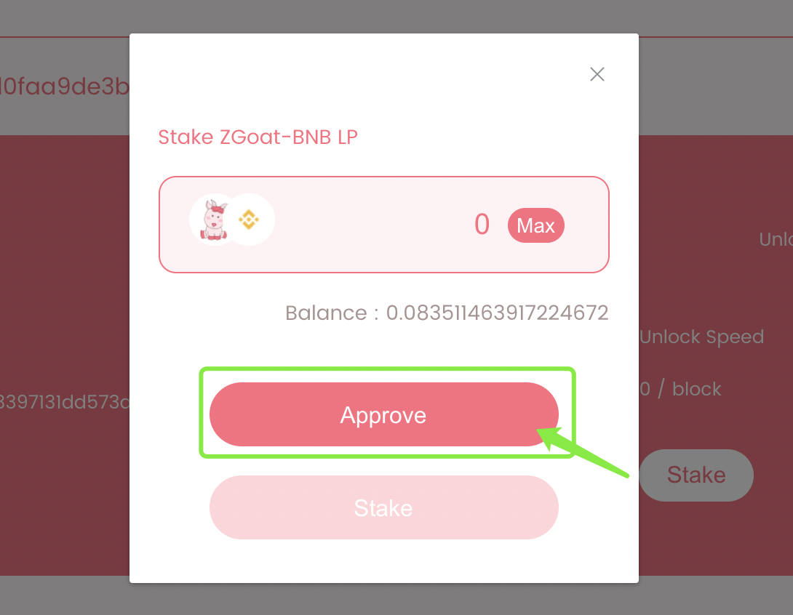
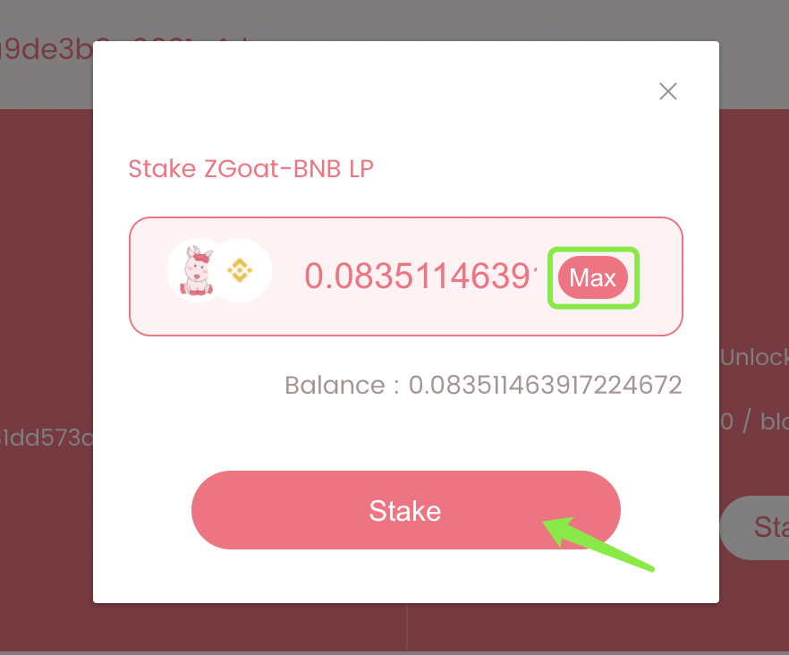
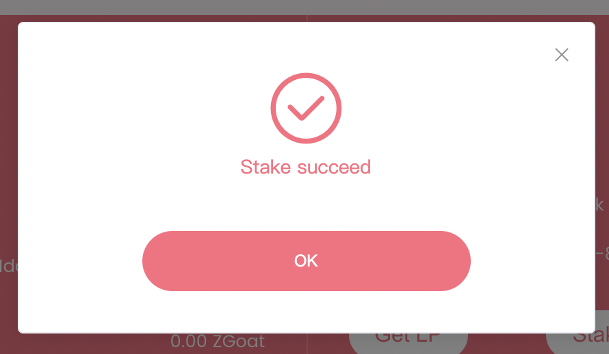
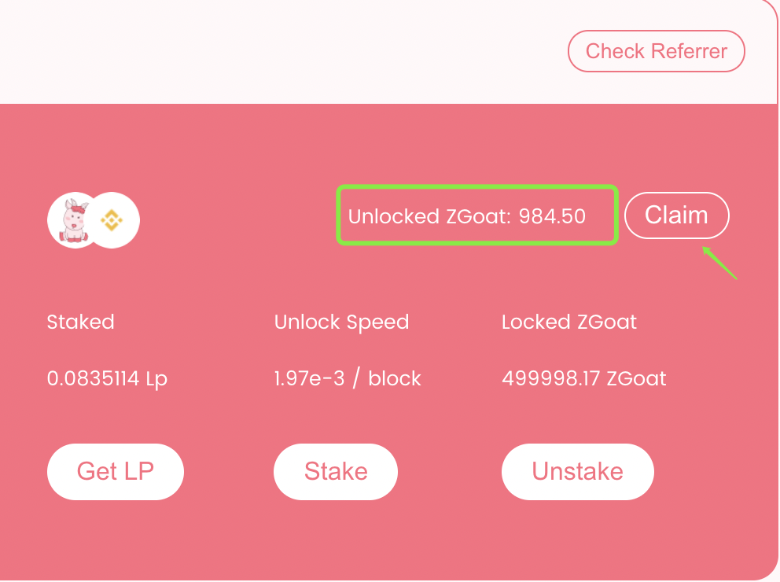

# 5.如何解锁ZGoat？

⚠️ 冻结ZGoat：用户可通过平台空投、心愿奖励等方式获得冻结的ZGoat（无法进行质押LP等交易转账）

🚩 解锁ZGoat：用户可通过质押LP解锁 ZGoat , 解锁步骤如下：👇

**第1步：Get LP**

点击 \[Get LP\] ,跳转至添加流动性页面

**第2步：添加流动性**

输入要组LP的 ZGoat 的数量，点击 \[ Add \] 添加流动性

#### **第3步：Get LP 成功**

添加完流动性，可在Pancake \[ Liquidity \]查看 ，也可以点击\[ Stake \]，查看添加的LP数量

#### **第4步：Stake** 

点击 \[Stake\]，首次质押需先授权，点击\[Approve\]，授权成功后，可选择点击 \[Max\]，质押全部LP；也可在输入框输入质押的LP数量，点击 \[Stake\]，确认信息无误后，点击 \[确定\]，质押LP

#### **第5步：质押成功**

质押成功后，可从 Stake 处查看自己质押的LP数量

#### **第6步：领取解锁 ZGoat**

点击 \[Claim\] ,可领取解锁的ZGoat



Tips:添加/解除质押LP，解锁的ZGoat会自动帮您领取，解锁速度也会重新调整

