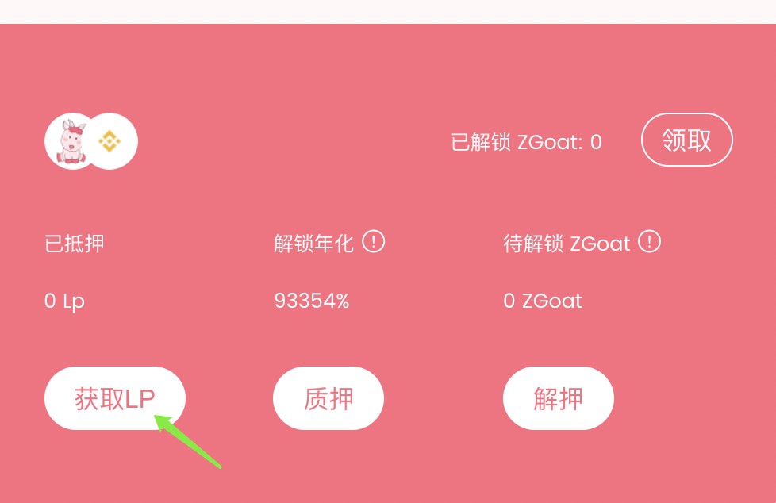

# 7.如何解锁ZGoat？

⚠️ _用户可通过平台空投、心愿奖励等方式可获得ZGoat奖励（锁仓状态，无法进行质押LP等交易转账）_



**第1步：获取 LP**

点击 \[Get LP\] ,跳转至添加流动性页面

**第2步：质押**

点击 \[ 质押 \] 


如果是第一次质押需要授权，点击\[ Approve \]


授权成功后，您可以在输入框输入数量或者点击\[ 全部 \]，然后点击\[ 质押 \]，确认信息无误后，点击 \[确定\]，即可质押LP

#### **第3步：自动解锁**

质押成功后，ZGoat会自动解锁，您可以在此看到 ZGoat的解锁数量增加，解锁完成后，点击\[ 领取 \]即可获得解锁的ZGoat

Tips:

* 解锁APY随着时间增加，将逐步达到最大解锁APY
* 每次进行添加/解押LP，解锁的ZGoat会自动领取，相应的数据会重新开始计算

