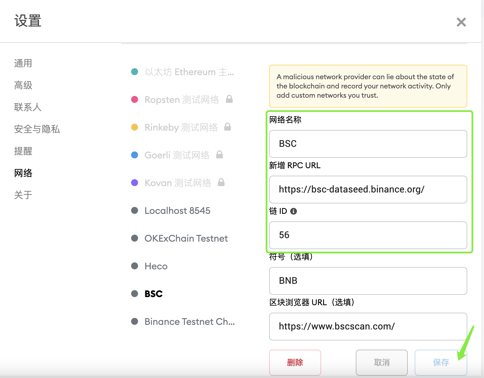

# Tutorial

**PC version tutorial ：**

1、Try to use mainstream wallets that support BSC, such as MetaMask.

MetaMask Download link：[https://metamask.io/](https://metamask.io/)

2、Click \[custom RPC\] to configure the BSC network

Network name: BSC

Add RPC URL:[https://bsc-dataseed.binance.org/](https://bsc-dataseed.binance.org/)

Chain ID:56

Symbol \(optional\): BNB

Block browser URL \(optional\):[https://www.bscscan.com/](https://www.bscscan.com/)

After configuring the parameters, click \[save\].

