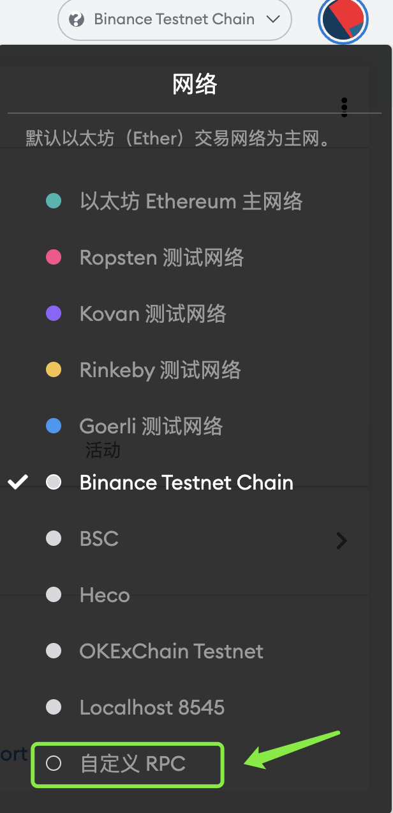

# 新手教程

**PC版新手教程：**

1、尽量选择使用支持BSC的主流钱包，如：MetaMask等

MetaMask下载链接：[https://metamask.io/](https://metamask.io/)

2、点击 \[自定义RPC\] ，配置BSC网络

网络名称：BSC

新增RPC URL：[https://bsc-dataseed.binance.org/](https://bsc-dataseed.binance.org/)

链ID：56

符号（选填）：BNB

区块浏览器URL（选填）：[https://www.bscscan.com/](https://www.bscscan.com/)

配置完参数点击 \[保存\] 即可

