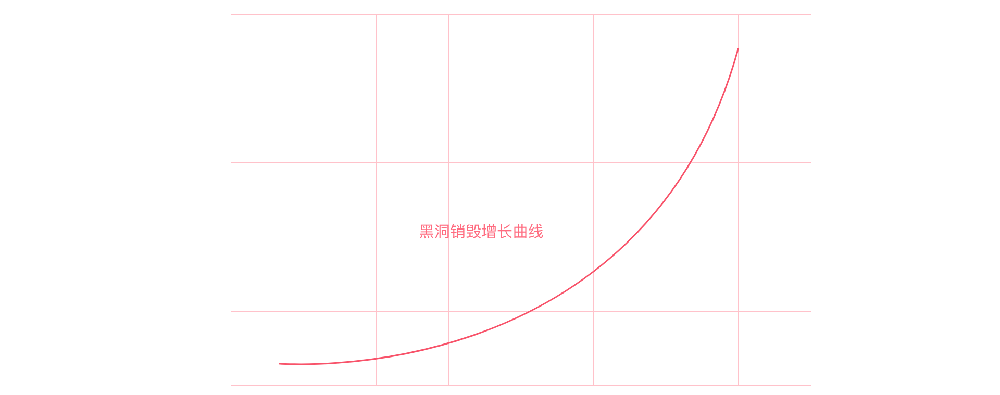
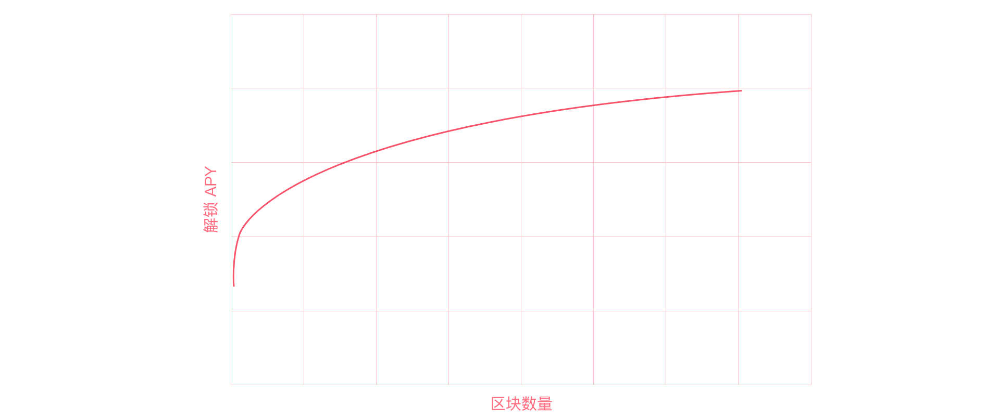

# 解锁规则

所有通过空投、心愿单、社群活动获得的ZGoat奖励均需要通过质押LP进行解锁。

**1\) 解锁计算公式：**

解锁速度Unlock Speed = LP \* Time ^ 0.125 \*  K

最大解锁速度 Unlocked MaxSpeed = Locked\_Num / 86400

解锁数量 Unlocked\_Num= Unlock Speed \* Time


LP指用户用于解锁ZGoat所质押的LP数量；Time指质押时间内的区块数；K为常数定值，可根据市场数据进行调节。


从上图可以看出，随着解锁时间的增加，解锁速度呈指数增长，最终达最大解锁速度。

**2）解锁APY**

解锁APY = 已解锁ZGoat / 质押LP的ZGoat价值  \* （365天 / 已解锁ZGoat的花费天数）\* 100%

进一步简化可得：

**APY =** Time ^ 0.125 \*  K1 \* 100%


**K1为定值常数，可根据市场数据进行调节。**


注意，由于解锁速度不能大于最大解锁速度，因此随着时间推移APY也将达到最大值。

