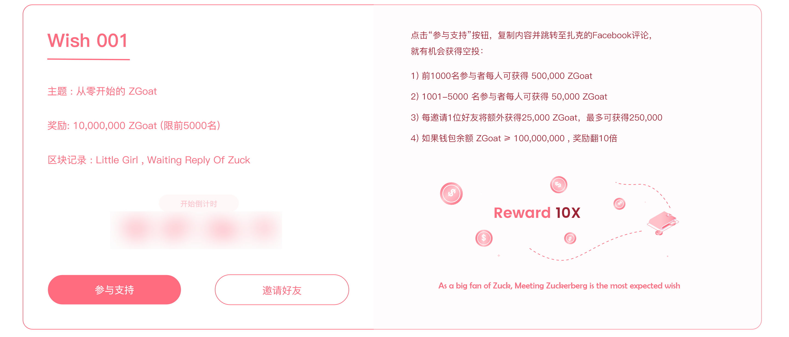

# Wish001：遇见扎克伯格的小女孩

> When graduated for job, as a female, it's so hard because of sexism. As a code farmer, I made a wish to my idol, Zuckerberg. Fortunately, then I get a job in blockchain, feeling cheerful, fair and loved. My wish comes ture. The idea about WISH TOKEN comes in my mind, to help everyone say wish out. At that time, Zuck tweets "My goats: MAX and BITCOIN", therefore the token is named "ZGOAT". And I make the second wish: Little Girl, Meet Zuck!

做为一名女程序员，由于性别原因，毕业找工作时经历了各种歧视、焦虑、心烦、不安..., 于是我向我的偶像扎克伯格许愿，希望找到一份好工作。

幸运的是，我的心愿实现了，我在区块链行业找到一份非常愉快、公平并且感觉到被爱的工作。至此我的脑海中出现了心愿Token的想法，让每个人都能说出自己的心愿。当时扎克伯格发了一条推文："My Goats: MAX and BITCOIN", 因此就把这个币命名为Zuck‘s Goat, 其Token为"ZGoat", 并且我许下了第二个愿望：**想见扎克伯格**。

虽然扎克伯格高高在上，想见上他一面看起来遥不可及。但是，我相信世界上总会有奇迹的，于是我在ZGoat平台发起了第一个心愿，如果您也支持我的心愿，请帮我在扎克的Facebook下面留言吧，至少让他知道：有个小女孩，挂念着他～

\[图片，扎克伯格与小女孩\]

为感谢朋友们的支持，ZGoat平台将拿出163亿个ZGoat进行奖励。

**参与方式：**

1. 点击心愿单的Support按钮，将复制的文字粘贴到扎克伯格Facebook下评论即可：[立即参与](http://zgoat.org)
2. 邀请朋友参与

**奖励规则：**

1. 评论的第1-1000名，奖励1,000,000个ZGoat；
2. 评论的第1001-5000名，奖励10,000个ZGoat；
3. 评论的第5001-50000名，奖励5,000个ZGoat；

**附加说明：**

1. 若被奖励地址随机快照时，钱包余额大于等于1000w个ZGoat，则所获奖励乘以**10倍**；
2. 用户邀请朋友参与获得额外的奖励，每成功邀请一个用户参与并获奖，邀请人获得50,000个ZGoat奖励，上限为500,000个

_Tips:_ 

* _所有的空投奖励均需要解锁_
* _钱包余额以官方随机快照为准_

